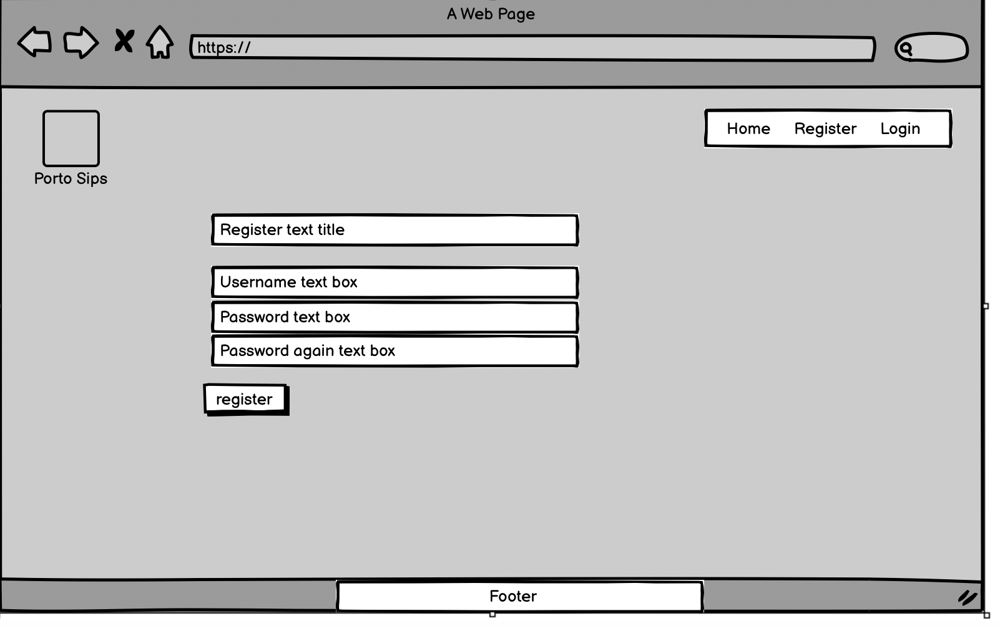

# Porto Sips - Discovering Porto's Hidden Gems

Welcome to Porto Sips, your ultimate guide to uncovering the best bars in Porto, Portugal.

Embark on a journey through the vibrant and historic streets of Porto as we unveil the city's hidden gems and top-rated bars. Whether you're a seasoned traveler or a local enthusiast, Porto Sips is your go-to destination for exploring the rich tapestry of Porto's bar scene.

Indulge in the essence of Portuguese culture as you immerse yourself in the eclectic ambiance of Porto's renowned bars. From charming taverns tucked away in cobblestone alleys to sleek and modern lounges boasting panoramic views of the Douro River, Porto Sips offers a curated selection of venues to suit every taste and preference.

Join our community of passionate bar aficionados as we share insider tips, personal experiences, and captivating stories from the heart of Porto's nightlife. With Porto Sips, your journey to discovering Porto's finest bars begins here. Cheers to unforgettable experiences and endless adventures in Porto!

[View the live project here.](https://berlin-bestbeers.herokuapp.com/)



## Index – Table of Contents
* [User Experience (UX)](#user-experience-ux)
  * [Project Goals:](#project-goals)
  * [User stories:](#user-stories)
      * [EPIC Admin Account management](#epic-admin-account-management)
      * [EPIC Post](#epic-post) 
      * [EPIC Comment](#epic-comment) 
      * [EPIC User Profile](#epic-user-profile) 
      * [EPIC UX and UI](#epic-ux-and-ui) 

* [Wireframes](#wireframes)

* [Features](#features)
  * [Installed Features](#installed-features)
    * [Navigation bar:](#navigation-bar)
    * [Home page:](#home)
    * [Register function:](#register-function)
    * [Login page:](#login-page)
    * [Logout page:](#logout-page)
    * [Add a post:](#add-a-post)
    * [Post detail:](#post-detail)
    * [User profile:](#user-profile)
    * [System Feedback messages:](#system-feedback-messages)
    * [Footer:](#footer)
    
    
* [Database Design:](#database-design)
    * [Models](#models)
	  * [Colours used](#colours-used)
	  * [Typography](#typography)
	  

* [Technologies](#technologies)
  * [Languages Used:](#languages-used)
  * [Frameworks and Libraries Used:](#frameworks-and-libraries-used)
  * [Software and Web Applications Used:](#software-and-web-applications-used)
* [Tests](#tests)
  
  * [Responsiveness and browser testing](#responsiveness-and-browser-testing)
  * [Validators:](#validators)
    * [W3C Markup Validator:](#w3c-markup-validator)
    * [W3C CSS Validator:](#w3c-css-validator)
    * [JSHint:](#jshint)
    * [PEP8 Online:](#pep8-online)
    * [Lighthouse test:](#lighthouse-test)
  
* [Deployment](#deployment)

* [Credits](#credits)
  * [Code](#code)
  * [Acknowledgements](#acknowledgements)

## User Experience (UX)

### Project Goals:
This blog is dedicated to exploring the vibrant bar scene in Porto city, Portugal. Our main objective is to provide a platform where users can share their experiences, recommendations, and insights about various bars across the city. The website offers comprehensive CRUD functionality, empowering registered users to contribute content, engage with posts, and manage their own contributions seamlessly. Users can post comments, upload photos, express their appreciation by liking posts, and retain control over their own content, including the ability to delete their own posts. Additionally, the admin maintains oversight and control over all user-generated content, ensuring the integrity and quality of the blog.

### User stories:

- #### EPIC Admin Account management
User Story: Account Registration and/or Login
As a user, I can register an account and/or log in so that I can update my visited beer bars, comment on other posts, and like them.

User Story: Manage All Posts
As an admin, I can create, read, update, and delete posts and comments so that I can manage the content of my blog and avoid improper content.

User Story: Create Drafts
As an admin, I can create drafts of posts so that I can finalize my post after a while.
User Story: Approve Comments
As an admin, I can approve or deny comments so that I can manage which comments can appear on my blog.

User Story: Approve Profiles
As an admin, I can approve or deny profiles.

- ### EPIC Post
USER STORY - Click on a post:

As a user, I can click on a post so that I can read it and interact with it.

USER STORY - Create a new post:

As a user, I can create a new post or multiple posts so that I can share my visit to a bar in Porto with others.

USER STORY - View all posts:

As a user, I can view all posts on the blog so that I can choose which bar to visit.

USER STORY - Manage posts with photos:

As a registered user, I can add and delete posts with accompanying photos so that I can share my experiences and memories of visiting bars in the city with others, and have control over the content I publish on the blog.

USER STORY - Like a post:

As a user, I can like a post so that I can express my appreciation or agreement with the content shared by others.

USER STORY - Delete own posts as a registered user:

As a registered user, I can delete my own posts so that I can manage my content and remove posts that I no longer want to be visible.

USER STORY - Comment on posts:

As a registered user, I can comment on posts so that I can engage with other users and share my thoughts or feedback on the content.

#### EPIC Comment
USER STORY - View Comments:

As a Site User, I can view comments on an individual post so that I can read the conversation.

USER STORY - Comment on a Post:

As a Site User, I can leave comments on a post so that I can be involved in the conversation.

#### EPIC User Profile
USER STORY - View Profile Details:

As a Site User i can check the post author details.

#### EPIC UX and UI
USER STORY - Responsiveness:
As a user, I can open the site on all my devices (laptop, mobile, and iPad) so that I can access the site anytime.

USER STORY - Design:
As a user, I can have a very positive impression of the site so that I always want to be connected there.

USER STORY - System Messages:
As a user, I can receive system messages when interacting with the site so that I understand how the website behaves.

USER STORY - Favicon:
As a user, I can see a favicon on the tab of the site so that I can easily recognize the website among all my open tabs.

### Wireframes

* Home

* Register

* After Register

* Post Detail

* Sign In

* Logout

* Add your Post

* User Profile

#### Models:
The Post class serves as the backbone of the blog, allowing users to share their experiences and insights about Porto Sips blog. Here's a detailed description of the model:

Title (CharField): Each post begins with a title, providing a concise overview of the user's experience or topic of discussion. This field is essential for quickly identifying the subject matter of the post.

Slug (SlugField): The slug field generates a unique and URL-friendly representation of the title. It ensures that each post has a distinct and easily accessible URL, facilitating navigation and search engine optimization.

Author (ForeignKey to User): This field establishes a connection between the post and its author, who is a registered user of the blog. It enables users to take ownership of their contributions and allows for attribution of content.

Featured Image (CloudinaryField): The featured image field allows users to include visually engaging images that accompany their posts. It is implemented using CloudinaryField, providing seamless integration with Cloudinary for efficient image storage and management.

Excerpt (TextField): The excerpt field provides a brief summary or teaser of the post's content. It offers readers a glimpse into the post's main themes or highlights, encouraging them to delve deeper into the full article.

Content (TextField): The content field contains the main body of the post, where users can share their detailed experiences, insights, and opinions about the craft beer bars in Berlin. It accommodates longer-form text content, allowing users to express themselves fully.

Created On (DateTimeField): This field records the date and time when the post was created. It enables users to track the timeline of posts and provides context regarding the recency of each contribution.

Status (IntegerField): The status field indicates the current state of the post, such as draft, published, or archived. It allows users to manage the visibility and accessibility of their posts, providing flexibility in content management.

Likes (ManyToManyField to User): The likes field enables users to express their appreciation or agreement with a post by liking it. It establishes a many-to-many relationship with the User model, allowing multiple users to like a post, fostering engagement and interaction within the community. 

|Post|         |
|--|--|
| type |  field name  |
| CharField  | title   |
| slugfield  | slug  |
| ForeignKey | author |
| DateTimeField | updated_on |
| TextField | content |
| CloudinaryField | featured_image |
| TextField  | excerpt |
| DateTimeField | created_on|
| IntegerField | status |
| DateTimeField | created_on|
| ManyToManyField | Likes |

Post (ForeignKey to Post): This field establishes a relationship between the comment and the post it pertains to. Utilizing a ForeignKey, each comment is associated with a specific post, fostering contextual relevance and organization.

Parent Comment (ForeignKey to self): The parent_comment field allows for hierarchical structuring of comments by linking a comment to its parent comment, if applicable. This feature facilitates threaded discussions and nested replies within comment threads.

Name (CharField): The name attribute represents the author's name or pseudonym associated with the comment. It provides attribution to the comment creator and aids in distinguishing between different contributors.

Email (EmailField): This field captures the email address of the comment author. While optional, it offers a means of contact or verification for comment moderation purposes.

Body (TextField): The body attribute contains the textual content of the comment, where users can express their thoughts, opinions, or reactions to the post. It accommodates varying lengths of text, allowing users to articulate their feedback comprehensively.

Created On (DateTimeField): Recording the date and time of comment creation, the created_on field provides temporal context to comments. It facilitates chronological ordering and helps users gauge the recency of comments within a post.

Approved (BooleanField): The approved attribute signifies whether a comment has been reviewed and approved for publication. By default, comments are marked as unapproved, requiring moderation before becoming visible to other users.

|Comment|         |
|--|--|
| type |  field name  |
| ForeignKey | post |
| CharField| name|
| EmailField| email|
| TextField| body |
| DateTimeField | created_on|
| BooleanField| approved|

The user profile template is designed to display information about a specific user's profile on the Porto Sips Blog website. It extends the base HTML template to maintain consistency with the overall website design.

The profile information displayed includes the following:

Username: Displays the username of the user whose profile is being viewed.
Email: Shows the email address associated with the user's account.
Additional profile fields can be added as needed by uncommenting the relevant lines of code and inserting the appropriate template variables.

|User Profile|         |
|--|--|
| type |  field name  |
| OneToOneField |post|
| TextField| bio|
| CloudinaryField| avatar|

**Likes**, **Dislikes** are also created as feature for registered users.

### Colours used:

Bootstrap dark and warning

### Typography

Shadows Into Light

## Features

#### Navigation bar:
The navigation bar utilizes Bootstrap's "fixed-top" class, ensuring that it remains pinned to the top of the webpage regardless of scrolling. This means that as users navigate through the page content, the navigation bar remains visible at the top of the browser window, providing constant access to essential navigation links and options. By employing this feature, users can easily access site functionality and move between different sections of the website without having to scroll back to the top to access the navigation menu.

The navigation items appear according to the user status. If logged in, the user can see the Home /Add Post / Logout / Username. This last includes a Font Awesome icon (fas fa-user):



Otherwise, the following items will appear: Home / Register / Login

For small devices the navbar is collapsed into a "hamburger menu", and turns to a fully responsive navigation bar. Here the example for the navbar tested on iPhone 8 Plus viewport:



#### Home page:

On the homepage, just below the navbar, users can find a section showcasing the six most recent posts contributed by other users. This section is meticulously designed using Bootstrap's grid layout, presenting posts in an organized and visually appealing manner.

Each post in this section features:

A captivating featured image: Users have the opportunity to upload an image that best represents their post. If no image is uploaded, a placeholder image featuring various craft beers will be displayed.
Author details: The name of the user who authored the post is prominently displayed.
Bar name or Post title: The title of the post is displayed, with a maximum of 30 characters to maintain brevity and clarity.
Post content snippet: A brief excerpt of the post content is provided to offer users a glimpse into the topic being discussed.
Posting date: The date when the post was created is clearly indicated, allowing users to discern the recency of each contribution.
Like count: An icon representing a heart (far fa-heart) followed by the number of likes the post has received is displayed, indicating the level of user engagement.
Comment count: An icon representing comments (far fa-comments) followed by the number of comments on the post is showcased, providing insights into the level of discussion around the post.
By clicking on any post, users are seamlessly directed to the detailed page dedicated to that specific post, where they can explore the content further and engage with other users through comments and likes. This section serves as a dynamic showcase of recent updates, encouraging users to stay informed and engaged with the community.

#### Register function:

All users can register theirselves to start to interact with the website and/or other users. 
To access the registration mode, the user can use the link through the navbar.

To create an user account, an username, a password and an optional email registration has to be provided.



#### Login page:

The website is accessible to all users, offering basic functionalities such as viewing posts. However, registered and logged-in users enjoy full interactivity, including the ability to create and delete their own posts, comment on others' posts, and like content. This personalized experience enhances engagement and fosters a sense of community among users. 

The Login access can be found here:


 


#### Logout page:

Users can access the Logout page through the navbar link available while logged in. Clicking on Logout instantly logs them out of their account and redirects them back to the Home page, ensuring a seamless transition between sessions.



Clicking ****"Cancel"** button, the user will be redirected to the previously visited page. 

#### Add a Post

Registered users have the ability to create new content, specifically posts about bars, which can be accessed via the navigation bar. This feature is exclusive to registered users who have chosen to sign up for the site. By clicking on the relevant navbar link, users can share their experiences at a bar or recommend one, accompanied by a photo of the bar taken by them. This functionality is made possible through the utilization of the SummernoteWidget.



The adding post feature is the same to all users and has the fields:
Title, Content, Excerpt (to appears at the Bars List), Image upload button (only one photo each post can be uploaded), and the buttons **"Post"** / **"Cancel"**.

In case that the user doesn't upload any photos, a default placeholder photo will be displayed. 

Upon completion of all fields in the post creation form, users can submit their post by clicking on the "Submit" button. Once submitted, the post will be stored in the database as a draft and await approval or rejection by the admin. The purpose of this approval or rejection process is to prevent duplicate entries of bars. Consequently, the "Bars List" can serve as a curated list or guide showcasing the best bars in Porto. Users also have the option to click on "cancel" if they decide not to proceed with submitting their post. 

#### Post detail

When a user clicks on a post, they are directed to the Post Detail page, where they encounter a headline displaying the name of the bar or post. Below the headline, the name of the post author and the date of posting are displayed. On larger screens, the photo uploaded by the author is showcased alongside the headline.

For logged-in users, interaction options such as commenting and liking/disliking are available. When a logged-in user decides to comment on a post, they are presented with a text field to write their comment and a button labeled "Submit" to submit their input.



For non-logged-in users, the Post Detail page and comments are visible, but the ability to comment and like is disabled. These users have the option to read all posts, navigate the entire website, and register to gain access to interactive features.

All users, regardless of their logged-in status, can view the number of likes and comments within a post. However, interaction with these elements is restricted based on the user's login status.

Font Awesome icons, specifically the "fa-heart" and "fa-comment" icons, are utilized to visually represent the liking and commenting functionalities. When clicked on, the like icon changes color to indicate user interaction.

#### User Profile

The user profile section provides both logged-in and non-logged-in users with the ability to view certain details about the post author, such as their username and email. This feature offers a level of transparency and interaction within the community, allowing users to connect with the authors of posts they find interesting or informative.

While the current implementation provides basic information about the post author, there is potential for further enhancements and expansions in the future. For example, additional profile fields could be included to provide more context or background about the author, such as their bio, avatar, social media links, or other relevant information. This could enrich the user experience and foster greater engagement and connection among users within the community.

#### System Feedback messages:

 this Blog incorporates system or flash messages as a means of providing users with immediate feedback regarding their actions on the website. These messages are triggered by specific user actions and are designed to inform users of the outcome of their actions.

These messages appear temporarily on the screen for a duration of three seconds before being automatically removed. They serve as quick, concise notifications that inform users about the completion of their actions, ensuring a smooth and responsive user experience. 

Here some examples :


 


##### Favicon:

Favicon - the favicon was created with https://realfavicongenerator.net/

#### Footer:

The webiste Footer appears in all pages and is featured at the bottom. 2 sections are used to build the Fotter:

On top, a link to the github of the blog creator.

Below the Social Media links, including Font Awesome icons of Facebook, Twitter, Instagram and Youtube. The social media are actually being connect the home page of each social media, and it was built like this to shows the possibility of connection. 



## Technologies

### Languages Used:

  - HTML5
  - CSS3
  - JavaScript
  - Python

### Frameworks and Libraries Used:

  - [Bootstrap:](https://getbootstrap.com/) Bootstrap CSS Framework used for styling and to build responsive web pages.
  - [Cloudinary:](https://cloudinary.com/) Used to store all blog images and uploaded images.
  - [Django:](https://www.djangoproject.com/) Main Python framework used in the development.
  - [Django Allauth:](https://django-allauth.readthedocs.io/en/latest/index.html) Used for authentication and account registration.
  - [Django Crispy Forms:](https://django-crispy-forms.readthedocs.io/en/latest/) Used to simplify the rendering of Django forms.
  - [dj_database_url:](https://pypi.org/project/dj-database-url/) Used to allow database urls to connect to the postgres database.
  - [ElephantSQL:](https://www.elephantsql.com/) Used as the website's database.
  - [Gunicorn:](https://gunicorn.org/) Green Unicorn, used as the Web Server to run Django on Heroku.
  - [Summernote:](https://github.com/summernote/django-summernote) To provide a WYSIWYG editor for customizing new blog content and add images.

### Software and Web Applications Used:

  - [Am I Responsive:](http://ami.responsivedesign.is) To chek the responsiveness of the website.
  - [Balsamiq:](https://balsamiq.com/) Used to create the wireframes.
  - [Chrome DevTools:](https://developer.chrome.com/docs/devtools/) Used to test the response on different screen sizes, debugging and to generate a Lighthouse report to analyze page load.
  - [Font Awesome:](https://fontawesome.com/) Used to add icons for aesthetic and UX purposes.
  - [Git:](https://git-scm.com/) Git was used for version control by utilizing the Gitpod terminal to commit to Git and Push to GitHub.
  - [GitHub:](https://github.com/) GitHub is used to store the projects code after being pushed from Git and to create the Kanban board used for this project.
  - [Google Fonts:](https://fonts.google.com/) 'Shadows Into Light'
  - [Heroku:](https://www.heroku.com/) For deployment and hosting of the application.
  - [HTML Validator:](https://validator.w3.org/) Check your code for HTML validation.
  - [JSHint:](https://jshint.com/) Check code for JavaScript validation.
  - [W3 CSS Validator:](https://jigsaw.w3.org/css-validator/) Check your code for CSS validation.
  

## Tests

### Responsiveness and browser testing

The app has been tested by friends and family who opened the app on different screen sizes like mobile phones, tablets and laptops. The tests were done using Chrome, Firefox and Edge.

### Validators:

#### W3C Markup Validator:

#### W3C CSS Validator:

To validate the CSS style of the project, the W3C CSS Validator Services were used and no errors were highlighted.



#### JSHint:

JSHint was used to validate the JavaScript - no errors showed.



#### PEP8 CI Python Linther:

PEP8 CI Python Linther (Python validator) used for these thests. The code passed without any errors on all files tested:

  - admin.py



  - forms.py



  - models.py



  - urls.py



  - views.py



#### Lighthouse Test:

 

 ## Deployment

The application was deployed to Heroku and the databese stored at ElephantSQL. The steps to deploy are as follows:

  - Login to [Heroku](https://dashboard.heroku.com/apps) dashboard to get an overview of installed apps.
  - Click on New => Create new app.
  - Choose a name for your application (must be unique) and enter your location.
  - Click on Create app.
  - After creating your new application, navigate and click on the Resources tab.
  - In the Add-ons search bar enter Heroku Postgres => Select Heroku Postgres.
  - A pop-up window till appear, choose Plan name Hobby Dev - Free.
  - Click on Submit order form.
  - Navigate to the Settings tab => click on Reveal Config Vars.
  - Copy the DATABASE_URL url value to the clipboard.
  - In GitPod => Create a new env.py file on top level directory.
  - In the env.py file:
    - Set environment variables: os.environ[”DATABASE_URL"] = "Paste in Heroku DATABASE_URL Link”
    - Add in secret key: os.environ[”SECRET_KEY"] = "Make up your own randomSecretKey”
  - In Heroku => Navigate to the Settings tab => click on Reveal Config Vars.
  - Add SECRET_KEY to Config Vars with the randomSecretKey value previously chosen.
  - In the settings.py file:
    - Remove the insecure secret key and replace it with: SECRET_KEY = os.environ.get(’SECRET_KEY')
    - Update to use the DATABASE_URL: dj_database_url.parse(os.environ.get(”DATABASE_URL"))
  - Save all files and Make Migrations: python3 manage.py migrate
  - Login to [Cloudinary](https://cloudinary.com/) and navigate to the Cloudinary Dashboard.
  - Copy your CLOUDINARY_URL API Environment Variable to the clipboard.
  - In the env.py file:
    - Add Cloudinary URL: os.environ["CLOUDINARY_URL"] = ”cloudinary://paste in API Environment Variable”
  - In Heroku => Navigate to the Settings tab => click on Reveal Config Vars.
  - Add ’CLOUDINARY_URL’ to Config Vars with the in API Environment Variable value.
  - In the settings.py file:
    - Add Cloudinary Libraries to installed apps (note: order is important) ’cloudinary_storage',  ’django.contrib.staticfiles', ’cloudinary',
    - Add the following code below STATIC_URL = ’/static/' to use Cloudinary to store media and static files:
      - STATIC_url = '/static/'
      - STATICFILES_STORAGE = ’cloudinary_storage.storage.StaticHashedCloudinaryStorage'
      - STATICFILES_DIRS = [os.path.join(BASE_DIR, ’static')]
      - STATIC_ROOT = os.path.join(BASE_DIR, ’staticfiles')
      - MEDIA_URL = '/media/'
      - DEFAULT_FILE_STORAGE = 'cloudinary_storage.storage.MediaCloudinaryStorage'
    - Link file to the templates directory in Heroku: TEMPLATES_DIR = os.path.join(BASE_DIR, ’templates')
    - Change the templates directory to: TEMPLATES_DIR: 'DIRS': [TEMPLATES_DIR],
    - Add Heroku Hostname to ALLOWED_HOSTS: ALLOWED_HOSTS = [”Your_Project_name.herokuapp.com”, ”localhost”]
  - Create 3 new folders on top level directory: media, static, templates
  - Create a Procfile on the top level directory
  - In the Procfile file:
    - Add the following code with your project name: web: gunicorn PROJ_NAME.wsgi
  - In the terminal: Add, Commit and Push.
  - In Heroku navigate to the Deploy tab => click on Deploy Branch.
  - When build process is finished click on Open App to visit the live site.
  - After deployed, the database was migrated to ElephandSQL, following the steps provided by Code Institute.

## Credits

  - A heartfelt appreciation goes out to all the bars acknowledged and highlighted by the fabricated users enlisted for testing purposes. We extend our gratitude for their participation.
  - [Am I Responsive:](http://ami.responsivedesign.is) To check responsiveness of the website.
  - [Balsamiq:](https://balsamiq.com/) To create all wireframes.
  - [Bootstrap:](https://getbootstrap.com/docs/4.6/getting-started/introduction/) To style and to build the webpage.
  - [Code Institute Slack Community:](https://app.slack.com/) The community was very helpful in 100% of the time.
  - [Code Institute Tutor Support:](https://app.slack.com/) For help and support.
  - [Django documentation:](https://docs.djangoproject.com/en/4.1/) Everything you need to know about Django.
  - [Stack Overflow:](https://stackoverflow.com) For troubleshooting and FAQ.
  - [W3Schools:](https://www.w3schools.com) Online Web Tutorials.

### Acknowledgements

  - Tutors, friends, family

